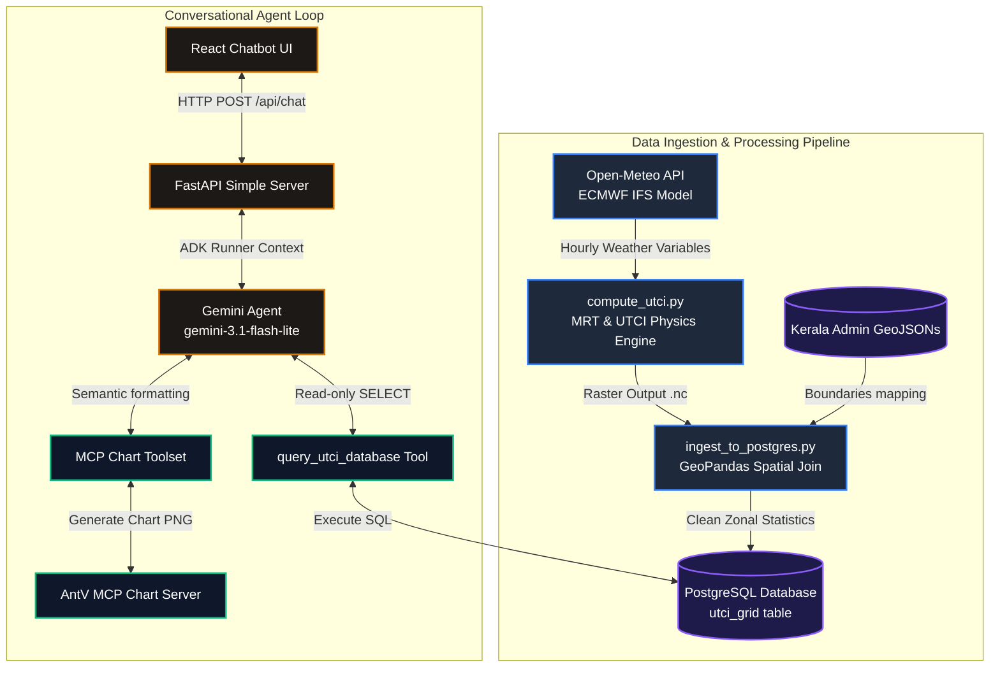

# UTCI Heat Stress Tracker Agent 🌡️🌴

An intelligent, spatial-temporal biometeorological analytics system and chatbot designed to track, query, and visualize **Universal Thermal Climate Index (UTCI)** levels across districts and taluks in Kerala, India.

---

## 📌 Overview & Purpose

The **UTCI Heat Stress Tracker Agent** automates the ingestion of high-resolution climate datasets, maps weather coordinates to administrative boundaries in Kerala, and provides an interactive conversational AI interface (chatbot). 

The goal of this system is to make complex biometeorological indices accessible to researchers, local planners, and citizens. By asking simple questions in plain English, users can query historical averages, calculate the physical area affected by heatwaves, or generate clean trend visualizations on demand.

### What is UTCI?
The **Universal Thermal Climate Index (UTCI)** is a state-of-the-art biometeorological metric (measured in **°C**) that represents the human body's physiological response to the outdoor thermal environment. Unlike simple temperature indexes, UTCI is computed from four meteorological variables:
1. **2m Air Temperature** (ambient temperature)
2. **2m Dew Point Temperature** (humidity proxy)
3. **10m Wind Speed** (convective cooling)
4. **Mean Radiant Temperature (MRT)** (estimates solar/terrestrial radiation fluxes)

## 📐 Architecture & Data Pipeline



---

## 🚀 Key Use Cases

*   **Peak Heat & Night Recovery Auditing**: Queries data twice daily: at **1:30 PM IST** (08:00 UTC) to evaluate peak solar heat stress, and at **10:30 PM IST** (17:00 UTC) to analyze whether conditions cool down enough at night for human physiological recovery.
*   **Spatial Aggregations & Zonal Statistics**: Identifies which taluks or districts are currently experiencing dangerous heat stress levels (e.g., above 32°C Strong Stress or above 38°C Very Strong Stress).
*   **Impact Area Estimation**: Computes the exact geographical area (in square kilometers) experiencing specific thermal conditions using local spatial grids.
*   **Conversational Data Visualization**: Automatically generates line charts (temporal trends) and column/bar charts (district/taluk comparisons) directly in the chat window.

---

## 🛠️ Technology Stack

### Data Pipeline & Processing
*   **Thermofeel**: ECMWF's official library for thermal comfort index calculations.
*   **Xarray & NetCDF4**: For handling multi-dimensional climate grids and raster arrays.
*   **GeoPandas & Shapely**: Maps lat-lon grid points to Kerala's administrative districts and taluks via vector-based polygon spatial joins.
*   **Numpy & Scipy**: Grid math and array computations.
*   **Schedule**: Handles the automated daily acquisition loop.

### Conversational AI & Backend
*   **Google ADK (Agent Development Kit)**: Powers the semantic reasoning engine and tool calling loop.
*   **Gemini Models**: Configured to run `gemini-3.1-flash-lite` for cost-efficient, fast reasoning.
*   **Model Context Protocol (MCP)**: Utilizes the `@antv/mcp-server-chart` protocol to construct charts dynamically.
*   **FastAPI & Uvicorn**: Lightweight REST API serving the web application and chat endpoints.
*   **PostgreSQL & SQLAlchemy**: Relational storage for tabular space-time grid data.

### Frontend Application
*   **React 18 & TypeScript**: Single-page application architecture.
*   **Vite**: Frontend build system.
*   **React Markdown & Remark GFM**: Renders rich formatting, markdown tables, and dynamic chart images.

---

## 📂 Project Structure

```text
UTCI_Tracker_Agent/
├── 📂 app/                   # Backend Agent Code (ADK framework)
│   ├── agent.py              # Root agent instructions and SQL database tools
│   └── simple_server.py      # FastAPI server running chat and last_update endpoints
├── 📂 pipeline/              # Data Acquisition & Processing Pipeline
│   ├── 📂 kerala_geojsons/   # Admin shape files (district/taluk)
│   ├── compute_utci.py       # Retrieves Open-Meteo variables and calculates UTCI
│   ├── ingest_to_postgres.py # Spatial joins coordinates and inserts to Postgres
│   ├── run_pipeline.py       # Master script to run fetch-process-ingest sequence
│   └── run_scheduler.py      # Background schedule loop for automated updates
├── 📂 frontend/              # Frontend React Web App
│   ├── 📂 src/
│   │   ├── 📂 components/
│   │   │   ├── Chatbot.tsx   # React Chatbot interface
│   │   │   └── Chatbot.test.tsx # UI component unit tests
│   │   └── setupTests.ts     # JSDOM matchers and mock settings
│   ├── package.json          # Frontend packages and scripts
│   └── vite.config.ts        # Vite + Vitest config
├── 📂 tests/                 # Testing Suite
│   ├── 📂 integration/
│   │   └── test_agent.py     # Agent response streaming tests
│   └── 📂 unit/
│       ├── test_compute_utci.py  # Mocked Open-Meteo & UTCI pipeline tests
│       └── test_ingest.py        # Database mapping and ingestion tests
└── pyproject.toml            # Python dependencies (numpy, xarray, geopandas, etc.)
```

---

## ⚙️ Setup & Running Locally

### 1. Prerequisites
Ensure you have the following installed on your machine:
*   [**Python 3.11+**](https://www.python.org/) & [**uv**](https://docs.astral.sh/uv/) (Astral's fast Python package manager)
*   [**Node.js v18+**](https://nodejs.org/) & `npm`
*   [**PostgreSQL**](https://www.postgresql.org/) (running locally, default port `5432`)
*   A **Gemini API Key** (set in a local `.env` file at the project root: `GEMINI_API_KEY=your_key_here`)

### 2. Database Setup
Create a local database named `utci-tracker-db`. You can configure your credentials via these environment variables (or let it fallback to defaults):
```bash
DB_USER=postgres
DB_PASSWORD=your_password
DB_HOST=localhost
DB_PORT=5432
DB_NAME=utci-tracker-db
```

### 3. Data Acquisition & Pipeline Run
Sync your virtual environment and install backend dependencies:
```bash
uv sync
```

**Option A: Manual Ingestion Sync**
To query Open-Meteo for the trailing 7 days of historical observations and ingest them:
```bash
uv run python pipeline/run_pipeline.py
```

**Option B: Automated Background Scheduler**
To set up continuous daily syncs at 1:45 PM and 10:45 PM:
```bash
uv run python pipeline/run_scheduler.py
```

### 4. Running the Web Application

**Start the Backend API Server:**
```bash
uv run python app/simple_server.py
```
*(Runs on `http://localhost:8000`)*

**Start the React Frontend:**
```bash
cd frontend
npm install
npm run dev
```
*(Runs on `http://localhost:5173`)*

---

## 🧪 Testing

### Backend tests (Pytest)
Runs calculations mocks, ingestion spatial joins checks, and streaming integration:
```bash
uv run pytest
```

### Frontend tests (Vitest)
Runs Vitest assertions inside JSDOM:
```bash
cd frontend
npm run test
```
